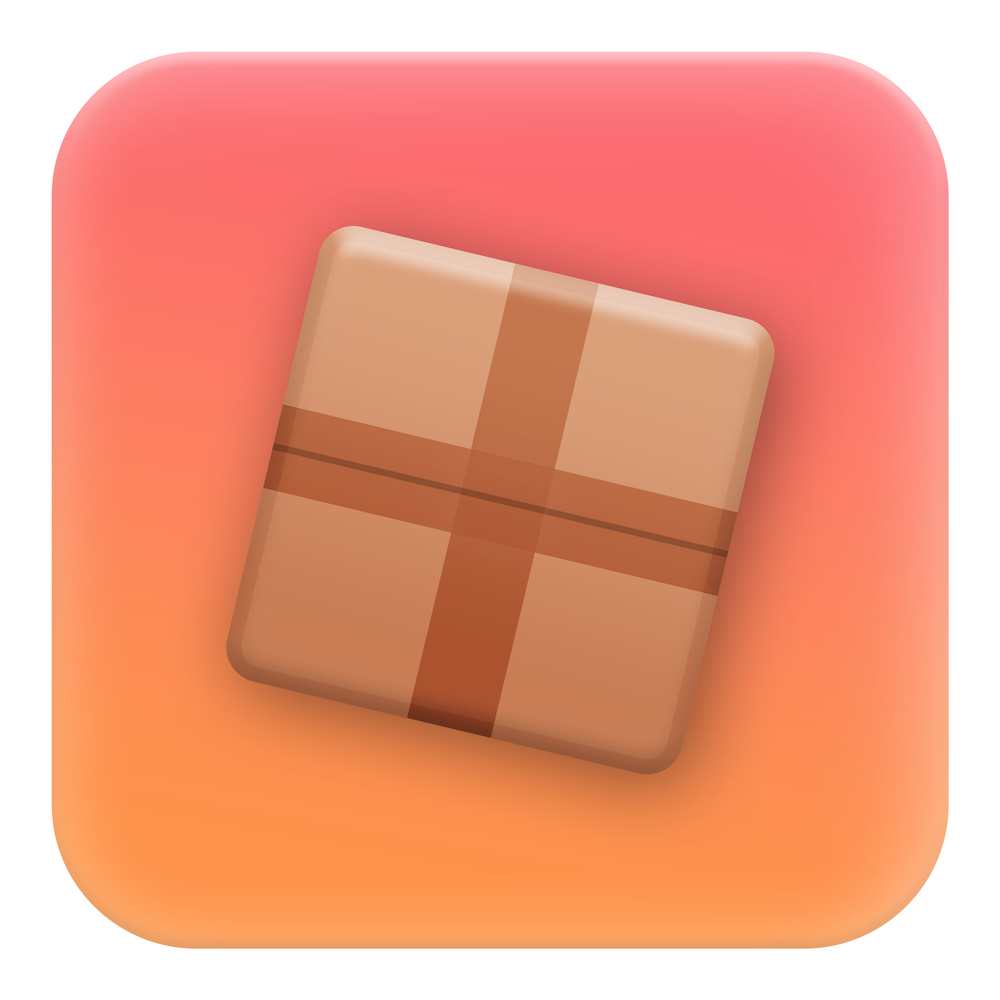

<div align="center">
    <a href="https://github.com/Neohertz/crate-react"></a>
	
</div>

<h1 align="center">
	Crate React
</h1>

<h4 align="center">
    <b>
        A hook library to integrate <a href="https://github.com/Neohertz/crate">@rbxts/crate</a> with react-lua.
    </b>
<h4>

<div align="center">

[![Downloads][downloads-shield]][downloads-url]
[![Contributors][contributors-shield]][contributors-url]
[![Stargazers][stars-shield]][stars-url] [![Issues][issues-shield]][issues-url]
[![License][license-shield]][license-url]

</div>

<p align="center">
    <a href="#📛-notice">Notice</a> •
    <a href="#💻-installation">Installation</a> •
    <a href="#💡-credits">Credits</a> •
    <a href="#⚒️-changelog">Changelog</a> •
    <a href="https://docs.neohertz.dev/docs/crate/about">Documentation</a>
</p>

---

# 📛 Notice

> [!CAUTION] 
> This package is still in **early beta**, expect breaking changes

# 📦 Dependancies

```bash
npm i @rbxts/crate @rbxts/react
```

# 💻 Installation

```bash
npm i @rbxts/crate-react
yarn add @rbxts/crate-react
pnpm add @rbxts/crate-react
```

# 💫 Usage

Lets assume we have the following crate.

```ts
export const sharedCrate = new Crate({
	coins: 0,
	xp: 0,
});
```

To use this crate with react, we can simply use the provided `useCrate()` hook.

```tsx
import { sharedCrate } from "./example/path";

export function MyCrateComponent() {
	const coins = useCrate(sharedCrate, (state) => state.coins);
	const xp = useCrate(sharedCrate, (state) => state.xp);

	useEffect(() => {
		print(`XP updated to ${xp}!`);
	}, [xp]);

	return <textlabel 
		Size={UDim2.fromOffset(200, 50)} 
		Text={`${coins}`} 
	/>;
}
```

## Bindings

This library provides a hook for using the state as a binding if you prefer.

```tsx
import { sharedCrate } from "./example/path";

export function MyCrateComponent() {
	const coins = useCrateBinding(sharedCrate, (state) => state.coins);

	return <textlabel 
		Size={UDim2.fromOffset(200, 50)} 
		Text={coins.map((v) => `${v}`)} 
	/>;
}
```

# 💡 Credits

This software uses the following:

-   Emojis were taken from [here](https://emojipedia.org/)

[downloads-shield]: https://img.shields.io/npm/d18m/%40rbxts%2Fcrate-react?style=for-the-badge
[downloads-url]: https://www.npmjs.com/package/@rbxts/crate-react
[contributors-shield]: https://img.shields.io/github/contributors/neohertz/crate-react?style=for-the-badge
[contributors-url]: https://github.com/Neohertz/crate-react/graphs/contributors
[stars-shield]: https://img.shields.io/github/stars/neohertz/crate-react?style=for-the-badge
[stars-url]: https://github.com/Neohertz/crate-react/stargazers
[issues-shield]: https://img.shields.io/github/issues/neohertz/crate-react?style=for-the-badge
[issues-url]: https://github.com/Neohertz/crate-react/issues
[license-shield]: https://img.shields.io/github/license/neohertz/crate-react?style=for-the-badge
[license-url]: https://github.com/Neohertz/crate-react/blob/master/LICENSE
