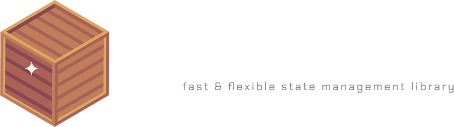

<br>
<p align="center">

</P>
<p align="center">
<i>(EARLY BETA)</i>
</p>

<br>

<p align="center">
<b>
<a href="https://neohertz.dev/docs/crate/about">About</a>
<a> - </a>
<a href="https://neohertz.dev/docs/crate/install">Install</a>
<a> - </a>
<a href="https://neohertz.dev/docs/crate/api">API</a>
<a> - </a>
<a href="https://www.mit.edu/~amini/LICENSE.md">License</a>
<a> - </a>
<a href="https://www.flaticon.com/free-icons/wooden-box">Icon Credit</a>
</b>
</p>


# About
`@rbxts/crate` is a small, smart, and easy to use state system for roblox-ts.<br>

# Install
```bash
npm i @rbxts/crate
```

# Updates

## v0.0.5
- Added second parameter to copy object passed to `.update()`. [#1](https://github.com/Neohertz/crate/issues/1)
- Fixed issue with equality check on update. [#3](https://github.com/Neohertz/crate/issues/3)

## v0.0.4
- Fixed `.get()` type issue with key.

## v0.0.3
- Internal state is fully immutable.
- Removed `reset()` method.
- `onUpdate()` callback is no longer invoked if the state doesn't truly change.
- Type fixes.