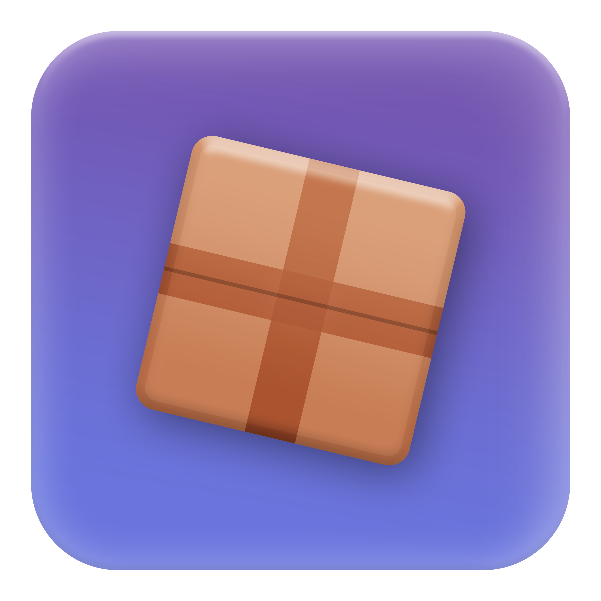

<div align="center">
    <a href="https://github.com/Neohertz/react-crate"></a>
	
</div>

<h1 align="center">
	React Crate
</h1>

<h4 align="center">
    <b>
        A hook library to integrate <a href="https://github.com/Neohertz/crate">@rbxts/crate</a> with react-lua.
    </b>
<h4>

<div align="center">

[![Downloads][downloads-shield]][downloads-url]
[![Contributors][contributors-shield]][contributors-url]
[![Stargazers][stars-shield]][stars-url] [![Issues][issues-shield]][issues-url]
[![License][license-shield]][license-url]

</div>

<p align="center">
    <a href="#-notice">Notice</a> •
    <a href="#-installation">Installation</a> •
    <a href="#-usage">Usage</a> •
    <a href="https://docs.neohertz.dev/docs/crate/about">Documentation</a>
</p>

---

# 📛 Notice

> [!CAUTION] 
> This package is still in **early beta**, expect breaking changes

# 💻 Installation

###  Dependancies

```bash
@rbxts/crate@1.0.0
@rbxts/react@^17.2.3
```


### Install
To install crate, run one of the following commands in your project's directory.

```bash
npm i @rbxts/react-crate
yarn add @rbxts/react-crate
pnpm add @rbxts/react-crate
```

# 💫 Usage

Lets assume we have the following crate.

```ts
import { Crate } from "@rbxts/crate"

export const sharedCrate = new Crate({
  coins: 0,
  xp: 0,
});
```

To use this crate with react, we can simply use the provided `useCrate()` hook.

```tsx
import { sharedCrate } from "./example/path";
import { useCrate } from "@rbxts/react-crate";

export function MyCrateComponent() {
  const coins = useCrate(sharedCrate, (state) => state.coins);
  const xp = useCrate(sharedCrate, (state) => state.xp);

  useEffect(() => {
    print(`XP updated to ${xp}!`);
  }, [xp]);

  return (
      <textlabel 
        Size={UDim2.fromOffset(200, 50)} 
        Text={`${coins}`} 
      />
    )
}
```

## Bindings

This library provides a hook for using the state as a binding if you prefer.

```tsx
import { sharedCrate } from "./example/path";
import { useCrateBinding } from "@rbxts/react-crate";

export function MyCrateComponent() {
  const coins = useCrateBinding(sharedCrate, (state) => state.coins);

  return (
      <textlabel 
        Size={UDim2.fromOffset(200, 50)} 
        Text={coins.map((value) => `${value}`)} 
      />
    )
}
```

# 💡 Credits

This software uses the following:

-   Emojis were taken from [here](https://emojipedia.org/)

[downloads-shield]: https://img.shields.io/npm/d18m/%40rbxts%2Freact-crate?style=for-the-badge
[downloads-url]: https://www.npmjs.com/package/@rbxts/react-crate
[contributors-shield]: https://img.shields.io/github/contributors/neohertz/react-crate?style=for-the-badge
[contributors-url]: https://github.com/Neohertz/react-crate/graphs/contributors
[stars-shield]: https://img.shields.io/github/stars/neohertz/react-crate?style=for-the-badge
[stars-url]: https://github.com/Neohertz/react-crate/stargazers
[issues-shield]: https://img.shields.io/github/issues/neohertz/react-crate?style=for-the-badge
[issues-url]: https://github.com/Neohertz/react-crate/issues
[license-shield]: https://img.shields.io/github/license/neohertz/react-crate?style=for-the-badge
[license-url]: https://github.com/Neohertz/react-crate/blob/master/LICENSE
